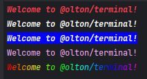

<div align="center">

# Terminal

<div align="center">



</div>


[](https://standardjs.com)


`Terminal` - is a JavaScript library for working with terminal. 
With `Terminal` you can create colored and styled outputs. Also, you can manipulate the cursor and screen in the terminal.

</div>

---

## Installation

```bash
npm install @olton/terminal
```

## Terminal output

You can create colored and styled outputs using `term` and `termx` functions.

### term()

With `term(msg, options)` function you can put text into terminal and styling it with options.
Options can be set as an object in the second argument.

```javascript
import { term, termx } from '@olton/terminal'

console.log(term('Hello World!', { style: 'bold, italic', color: 'redBright' }))
```

### termx()

With `termx` you can use chainable methods to set text style and color.
Chain must be ended with `write(msg)` method.

```javascript
import { term, termx } from '@olton/terminal'

console.log(termx.bold.italic.redBright.write('Hello World!'))
```

## Text style

You can set the text style using the `style` option. This is a comma-separated list of styles. The available styles are:
- `bold` - bold text
- `dim` - dim text
- `italic` - italic text
- `underline` - underlined text
- `inverse` - inverse text
- `hidden` - hidden text
- `strike` - strikethrough text

## Text color
You can set the text color using the `color` option. This is a comma-separated list of colors where first color is the text color and the second color is the background color. You can use next color values:

**1. Named colors**:

`black`, `red`, `green`, `yellow`, `blue`, `magenta`, `cyan`, `white`, `gray`
`blackBright`, `redBright`, `greenBright`, `yellowBright`, `blueBright`, `magentaBright`, `cyanBright`, `whiteBright`, `grayBright`

```js
import { term } from '@olton/terminal';

console.log(term('Hello World!', { color: 'yellowBright, blue' }))
console.log(termx.yellowBright.bgBlue.write('Hello World!'))
```

**2. Hex colors**: 

`#ff0000`, `#00ff00`, `#00f`, ...

```js
import { term } from '@olton/terminal';

console.log(term('Hello World!', { color: '#ff0000, #00ff00' }))
console.log(termx.hex('#ff0000', '#00ff00').write('Hello World!'))
```

**3. Color index**: from 0 to 255.


```js
import { term } from '@olton/terminal';

console.log(term('Hello World!', { color: '212, 27' }))
console.log(termx.ind(212, 27).write('Hello World!'))
```


#### Gradient color
You can set the gradient color using the `gradient` option. 
This is a comma-separated list of colors.
Colors can be in hex format.

```javascript
console.log(term('Hello World!', { gradient: "#ff0000, #0000ff" }))
console.log(term('Hello World!', { gradient: ["#f00", "#00f"] }))
console.log(termx.gradient("#f00", "#00f").write('Hello World!'))
```

## Cursor

You can use `Cursor` class to manipulate the cursor position or visibility in the terminal.
Use fabric method `cursor` to create a new instance of `Cursor`.

```javascript
import { term, Cursor } from '@olton/terminal'

console.log(term('Hello World!'))
Cursor.hide()
setTimeout(() => {
  Cursor.show()
}, 2000)
```
 

#### Cursor methods
- `hide()` - hide the cursor
- `show()` - show the cursor
- `to(x, y)` - move the cursor to the specified position
- `up(n)` - move the cursor up `n` lines
- `down(n)` - move the cursor down `n` lines
- `left(n)` - move the cursor left `n` characters
- `right(n)` - move the cursor right `n` characters
- `save()` - save the current cursor position
- `restore()` - restore the cursor position
- `lineUp()` - move the cursor up 
- `linesUp(n)` - move the cursor up `n` lines and save the position
- `linesDown(n)` - move the cursor down `n` lines and save the position
- `getPos()` - get the current cursor position. This method returns a promise with the position object `{ x, y }`

## Screen

You can use `Screen` class to manipulate the screen in the terminal.

Use fabric method `screen` to create a new instance of `Screen`.

```javascript
import { term } from '@olton/terminal'
import { screen } from '@olton/terminal'
console.log(term('Hello World!'))
setTimeout(() => {
  screen.clear()
}, 2000)
```

#### Screen methods
- `clear()` - clear the screen
- `clearLine()` - clear the current line
- `clearLeft()` - clear the left side of the current line
- `clearRight()` - clear the right side of the current line
- `clearDown()` - clear the screen from the current line down
- `clearUp()` - clear the screen from the current line up
- `size()` - get the current screen size.

```js
import { Screen } from '@olton/terminal'

// Clear terminal screen 
// and set cursor to the top left corner
Screen.clear()
```

> [!NOTE]
> Methods `clearLine`, `clearLeft`, `clearRight`, `clearDown`, `clearUp` not moved a cursor.

---
## License

This project is licensed under the MIT License. See the [LICENSE](LICENSE) file for details.

---
## Code Standards

[](https://github.com/standard/standard)

---

## Support

If you like this project, please consider supporting it by:

+ Star this repository on GitHub
+ Sponsor this project on GitHub Sponsors
+ **PayPal** to `serhii@pimenov.com.ua`.
+ **Patreon** https://www.patreon.com/metroui

---

Copyright (c) 2025 by [Serhii Pimenov](https://pimenov.com.ua)
